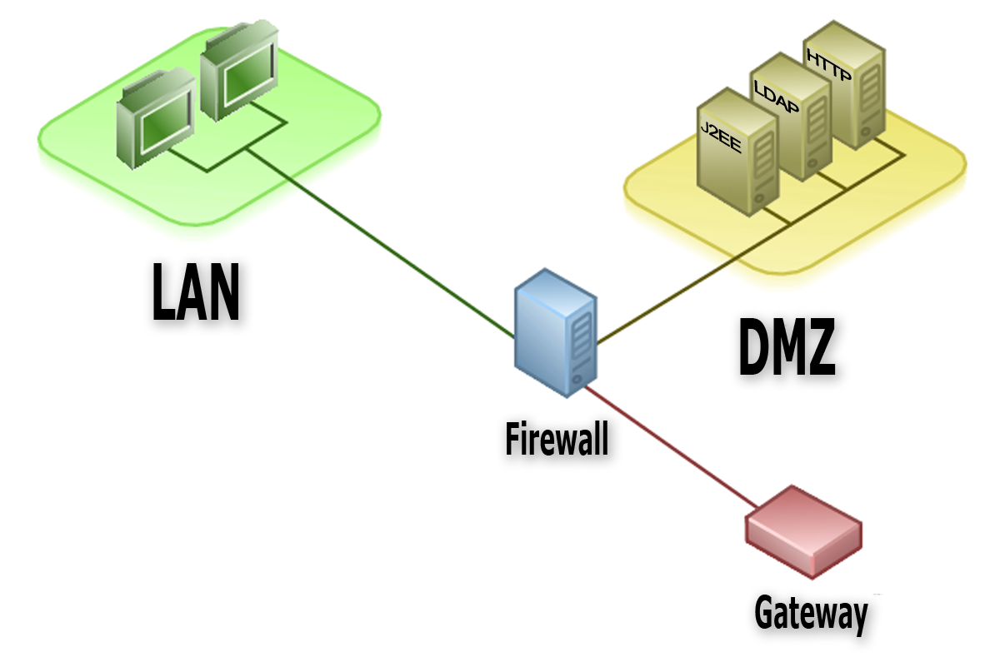

# Cortafuego Perimetral con DMZ

## [Esquema de red](https://github.com/MoralG/Cortafuego_Perimetral_con_DMZ/blob/master/Cortafuegos_Perimetral_con_DMZ.md#esquema-de-red)
------------------------------------------------------------------------------------------------
#### Vamos a utilizar tres máquinas en openstack, que vamos a crear con la receta heat: escenario3.yaml. La receta heat ha deshabilitado el cortafuego que nos ofrece openstack (todos los puertos de todos los protocolos están abiertos). Una máquina (que tiene asignada una IP flotante) hará de cortafuegos, otra será una máquina de la red interna 192.168.100.0/24 y la tercera será un servidor en la DMZ donde iremos instalando distintos servicios y estará en la red 192.168.200.0/24.

## [Cumplimientos](https://github.com/MoralG/Cortafuego_Perimetral_con_DMZ/blob/master/Cortafuegos_Perimetral_con_DMZ.md#cumplimientos)
------------------------------------------------------------------------------------------------
#### Configurar un cortafuegos perimetral en la máquina router-fw teniendo en cuenta los siguientes puntos:

* Política por defecto DROP para las cadenas INPUT, FORWARD y OUTPUT.
* Se pueden usar las extensiones que queremos adecuadas, pero al menos debe implementarse seguimiento de la conexión.
* Debes indicar pruebas de funcionamiento de todos las reglas.

## [Tareas](https://github.com/MoralG/Cortafuego_Perimetral_con_DMZ/blob/master/Cortafuegos_Perimetral_con_DMZ.md#tareas)
--------------------------------------------------------------------------------------------------
#### [Tarea 1](https://github.com/MoralG/Cortafuego_Perimetral_con_DMZ/blob/master/Cortafuegos_Perimetral_con_DMZ.md#tarea-1-la-m%C3%A1quina-router-fw-tiene-un-servidor-ssh-escuchando-por-el-puerto-22-pero-al-acceder-desde-el-exterior-habr%C3%A1-que-conectar-al-puerto-2222). La máquina router-fw tiene un servidor ssh escuchando por el puerto 22, pero al acceder desde el exterior habrá que conectar al puerto 2222.

#### [Tarea 2](https://github.com/MoralG/Cortafuego_Perimetral_con_DMZ/blob/master/Cortafuegos_Perimetral_con_DMZ.md#tarea-2-desde-la-lan-y-la-dmz-se-debe-permitir-la-conexi%C3%B3n-ssh-por-el-puerto-22-al-la-m%C3%A1quina-router-fw). Desde la LAN y la DMZ se debe permitir la conexión ssh por el puerto 22 al la máquina router-fw.

#### [Tarea 3](https://github.com/MoralG/Cortafuego_Perimetral_con_DMZ/blob/master/Cortafuegos_Perimetral_con_DMZ.md#tarea-3-la-m%C3%A1quina-router-fw-debe-tener-permitido-el-tr%C3%A1fico-para-la-interfaz-loopback). La máquina router-fw debe tener permitido el tráfico para la interfaz loopback.

#### [Tarea 4](https://github.com/MoralG/Cortafuego_Perimetral_con_DMZ/blob/master/Cortafuegos_Perimetral_con_DMZ.md#tarea-4-a-la-m%C3%A1quina-router-fw-se-le-puede-hacer-ping-desde-la-dmz-pero-desde-la-lan-se-le-debe-rechazar-la-conexi%C3%B3n-reject). A la máquina router-fw se le puede hacer ping desde la DMZ, pero desde la LAN se le debe rechazar la conexión (REJECT).

#### [Tarea 5](https://github.com/MoralG/Cortafuego_Perimetral_con_DMZ/blob/master/Cortafuegos_Perimetral_con_DMZ.md#tarea-5-la-m%C3%A1quina-router-fw-puede-hacer-ping-a-la-lan-la-dmz-y-al-exterior). La máquina router-fw puede hacer ping a la LAN, la DMZ y al exterior.

#### [Tarea 6](https://github.com/MoralG/Cortafuego_Perimetral_con_DMZ/blob/master/Cortafuegos_Perimetral_con_DMZ.md#tarea-6-desde-la-m%C3%A1quina-dmz-se-puede-hacer-ping-y-conexi%C3%B3n-ssh-a-la-m%C3%A1quina-lan). Desde la máquina DMZ se puede hacer ping y conexión ssh a la máquina LAN.

#### [Tarea 7](https://github.com/MoralG/Cortafuego_Perimetral_con_DMZ/blob/master/Cortafuegos_Perimetral_con_DMZ.md#tarea-7-desde-la-m%C3%A1quina-lan-no-se-puede-hacer-ping-pero-si-se-puede-conectar-por-ssh-a-la-m%C3%A1quina-dmz). Desde la máquina LAN no se puede hacer ping, pero si se puede conectar por ssh a la máquina DMZ.

#### [Tarea 8](https://github.com/MoralG/Cortafuego_Perimetral_con_DMZ/blob/master/Cortafuegos_Perimetral_con_DMZ.md#tarea-8-configura-la-m%C3%A1quina-router-fw-para-que-las-m%C3%A1quinas-lan-y-dmz-puedan-acceder-al-exterior). Configura la máquina router-fw para que las máquinas LAN y DMZ puedan acceder al exterior.

#### [Tarea 9](https://github.com/MoralG/Cortafuego_Perimetral_con_DMZ/blob/master/Cortafuegos_Perimetral_con_DMZ.md#tarea-9-la-m%C3%A1quina-lan-se-le-permite-hacer-ping-al-exterior). La máquina LAN se le permite hacer ping al exterior.

#### [Tarea 10](https://github.com/MoralG/Cortafuego_Perimetral_con_DMZ/blob/master/Cortafuegos_Perimetral_con_DMZ.md#tarea-10-la-m%C3%A1quina-lan-puede-navegar). La máquina LAN puede navegar.

#### [Tarea 11](https://github.com/MoralG/Cortafuego_Perimetral_con_DMZ/blob/master/Cortafuegos_Perimetral_con_DMZ.md#tarea-11-la-m%C3%A1quina-dmz-puede-navegar-instala-un-servidor-web-un-servidor-ftp-y-un-servidor-de-correos). La máquina DMZ puede navegar. Instala un servidor web, un servidor ftp y un servidor de correos.

#### [Tarea 12](https://github.com/MoralG/Cortafuego_Perimetral_con_DMZ/blob/master/Cortafuegos_Perimetral_con_DMZ.md#tarea-12-configura-la-m%C3%A1quina-router-fw-para-que-los-servicios-web-y-ftp-sean-accesibles-desde-el-exterior). Configura la máquina router-fw para que los servicios web y ftp sean accesibles desde el exterior.

#### [Tarea 13](https://github.com/MoralG/Cortafuego_Perimetral_con_DMZ/blob/master/Cortafuegos_Perimetral_con_DMZ.md#tarea-13-el-servidor-web-y-el-servidor-ftp-deben-ser-accesible-desde-la-lan-y-desde-el-exterior). El servidor web y el servidor ftp deben ser accesible desde la LAN y desde el exterior.

#### [Tarea 14](https://github.com/MoralG/Cortafuego_Perimetral_con_DMZ/blob/master/Cortafuegos_Perimetral_con_DMZ.md#tarea-14-el-servidor-de-correos-s%C3%B3lo-debe-ser-accesible-desde-la-lan). El servidor de correos sólo debe ser accesible desde la LAN.

#### [Tarea 15](https://github.com/MoralG/Cortafuego_Perimetral_con_DMZ/blob/master/Cortafuegos_Perimetral_con_DMZ.md#tarea-15-en-la-m%C3%A1quina-lan-instala-un-servidor-mysql-a-este-servidor-s%C3%B3lo-se-puede-acceder-desde-la-dmz). En la máquina LAN instala un servidor mysql. A este servidor sólo se puede acceder desde la DMZ.

## [Mejoras](https://github.com/MoralG/Cortafuego_Perimetral_con_DMZ/blob/master/Cortafuegos_Perimetral_con_DMZ.md#mejoras)
------------------------------------------------------------------------------------------------

#### [MEJORA 1](https://github.com/MoralG/Cortafuego_Perimetral_con_DMZ/blob/master/Cortafuegos_Perimetral_con_DMZ.md#mejora-1-implementar-que-el-cortafuego-funcione-despu%C3%A9s-de-un-reinicio-de-la-m%C3%A1quina): Implementar que el cortafuego funcione después de un reinicio de la máquina.

#### [MEJORA 2](https://github.com/MoralG/Cortafuego_Perimetral_con_DMZ/blob/master/Cortafuegos_Perimetral_con_DMZ.md#mejora-2-utiliza-nuevas-cadenas-para-clasificar-el-tr%C3%A1fico): Utiliza nuevas cadenas para clasificar el tráfico.

#### [MEJORA 3](https://github.com/MoralG/Cortafuego_Perimetral_con_DMZ/blob/master/Cortafuegos_Perimetral_con_DMZ.md#mejora-3-consruye-el-cortafuego-utilizando-nftables): Consruye el cortafuego utilizando nftables.
